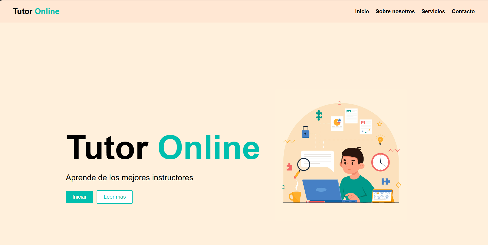
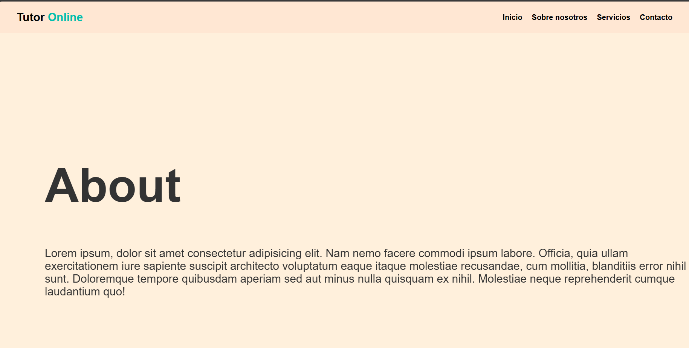
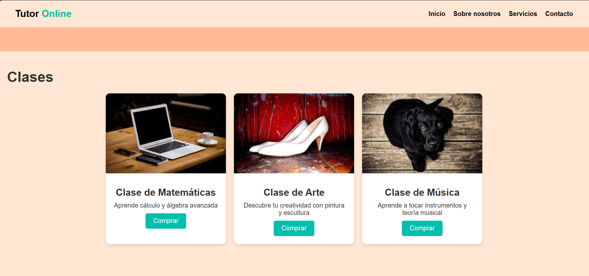
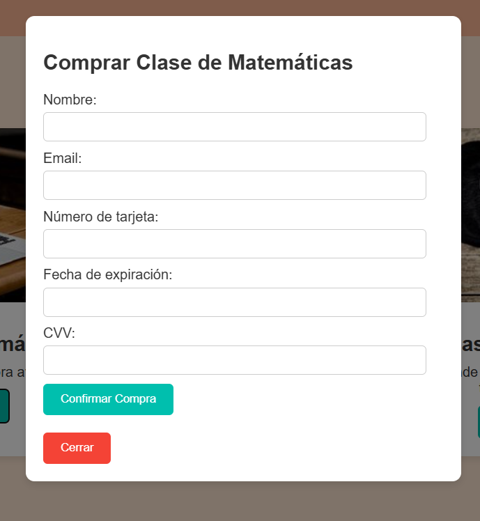
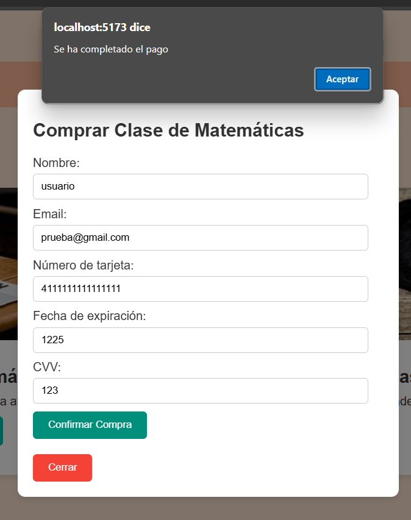
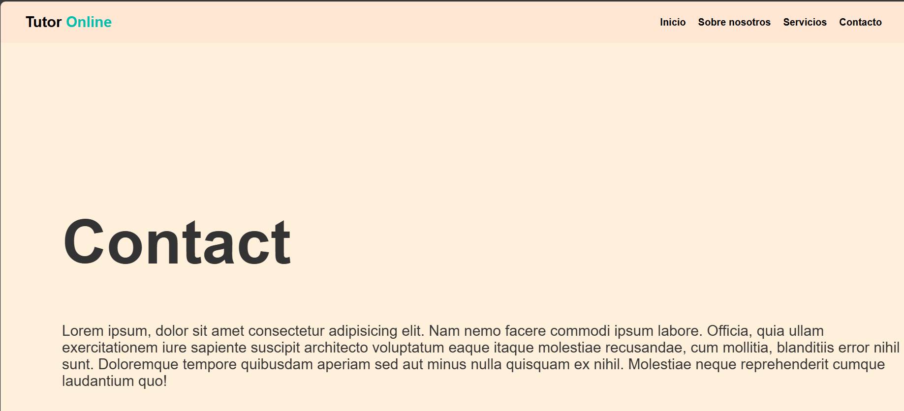
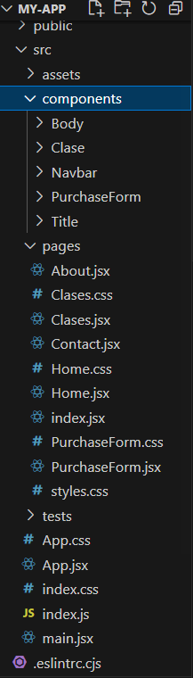

# Instrucciones de instalación y ejecución

Este archivo README.md proporciona instrucciones detalladas sobre la estructura del proyecto, cómo utilizar las vistas, cómo ejecutar las pruebas y cómo instalar y ejecutar el proyecto. También incluye la URL de despliegue en Vercel.

Nota* Por ahora solo puede ser usado la pagina de inicio (sin los botones) y la página de servicios (son las clases a comprar) el de servicios contiene la clases a comprar, es decir el formularioa llenar

# Proyecto Tutor Online
Este proyecto es una aplicación de tutoría en línea construida con React.
# Ventana de inicio

# Ventana "Sobre nosotros"

# Ventana "Servivios" Compra de clases

y

y

# Ventana de "Contacto"

# Características
- Navegación entre páginas utilizando React Router.
- Animaciones con Framer Motion.
- Formulario de compra de clases.

# Requisitos Previos
Asegúrate de tener instalado lo siguiente en tu máquina:
- Node.js (v14 o superior)
- npm (v6 o superior)
- MongoDB Compass
- MongoDB

# Instalación
Sigue estos pasos para clonar y configurar el proyecto en tu máquina local.

1.- Clona el repositorio:
git clone https://github.com/BethelSalazar/Project-R.git
cd Project-R
2.- Instala las dependencias del proyecto: npm install
3.- Ejecución del Proyecto Para iniciar el servidor de desarrollo, utiliza el siguiente comando: npm run dev El proyecto estará disponible en http://localhost:5173.

# Ejecución de Pruebas Para ejecutar las pruebas utilizando React Testing Library y Jest, utiliza el siguiente comando: npm test
Pruebas Incluidas
- Verificar envío de datos al servicio web: Asegura que los datos se envían correctamente desde el formulario.
- Renderización correcta del componente: Comprueba que un componente clave se renderiza con los datos esperados.
- Simulación de eventos de usuario: Simula un evento de usuario, como un clic para el envío del formulario, y verifica el comportamiento resultante. Ejemplo de Uso Navega a través de la aplicación utilizando la barra de navegación. Puedes comprar clases completando el formulario de compra.

# Descripción del proyecto (estructura y uso del proyecto)
src/
├── components/
│   ├── Body/
│   │   ├── Body.css
│   │   └── Body.jsx
│   ├── Clase/
│   │   ├── Clase.css
│   │   └── Clase.jsx
│   ├── Navbar/
│   │   ├── Navbar.css
│   │   └── Navbar.jsx
│   └── Title/
│       ├── Title.css
│       └── Title.jsx
├── tests/
│   └── Clase.test.jsx
├── App.jsx
└── main.jsx

# Uso del Proyecto
Este proyecto proporciona una plataforma de tutoría en línea con las siguientes características:

- Navbar: Navegación entre las páginas "Inicio", "Sobre nosotros", "Servicios" y un botón de "Login".
- Title: Componente para mostrar títulos con animaciones.
- Body: Componente para el contenido principal con animaciones.
- Clase: Componente para la compra de clases, que incluye un formulario para introducir información de contacto y método de pago.

# Prototipos de la Vista y Cómo Utilizarlas 
Vista de Inicio 
- Navbar: En la parte superior, permite navegar entre las secciones. 
- Title: Muestra el título de la página. 
- Body: Contenido principal que se desplaza de derecha a izquierda. Vista de Sobre Nosotros 
- Similar a la vista de Inicio, pero con contenido específico sobre la empresa o plataforma. 
Vista de Servicios (Clases) 
- Lista de clases disponibles para la compra. 
- Cada clase muestra una imagen, título, descripción y un botón para "Comprar".
- Al hacer clic en "Comprar", se despliega un formulario para completar la compra.

# Cómo Utilizar las Vistas
1.- Inicio: Navega a la página de inicio para ver la introducción y la navegación básica. 
2.- Sobre Nosotros: Haz clic en "Sobre nosotros" en la barra de navegación para obtener información sobre la empresa. 
3.- Servicios: Haz clic en "Servicios" en la barra de navegación para ver la lista de clases disponibles. 
4.- Comprar una Clase: En la sección de Servicios, haz clic en "Comprar" en cualquier clase para abrir el formulario de compra. Completa los datos y envía el formulario.

